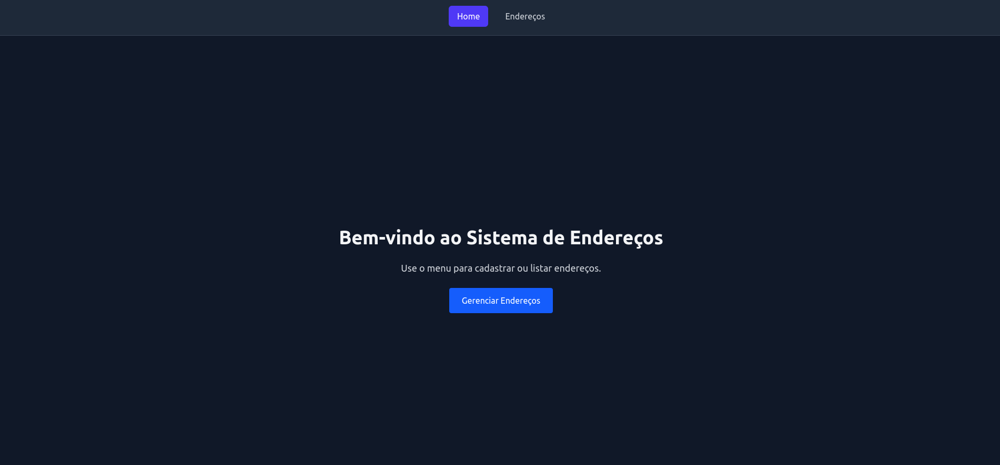
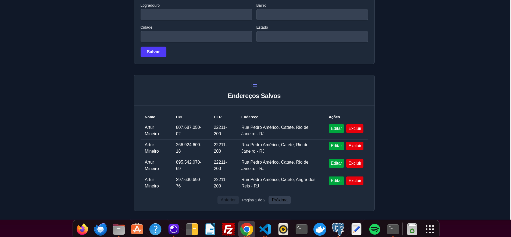
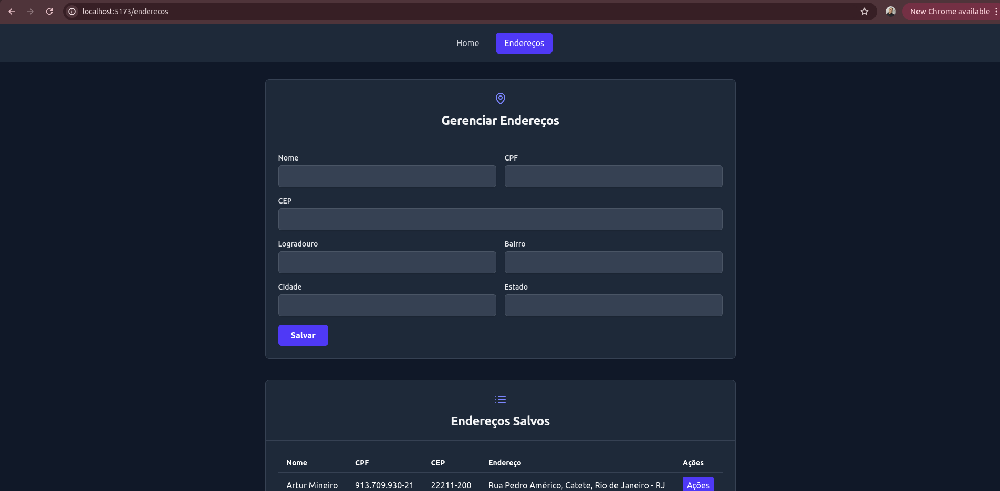
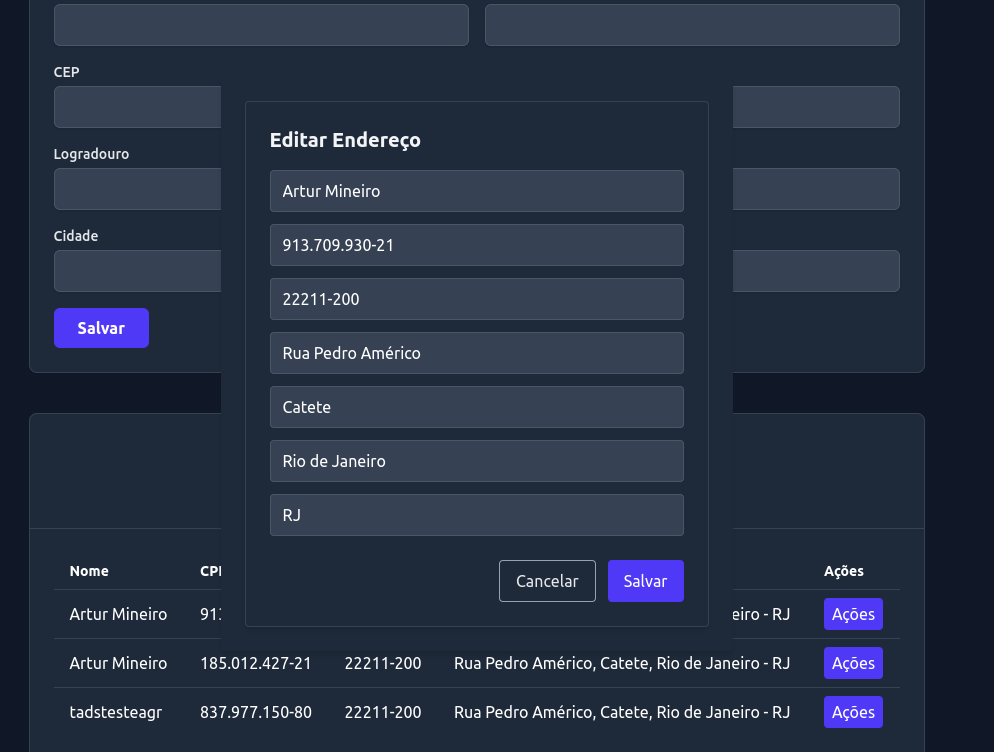
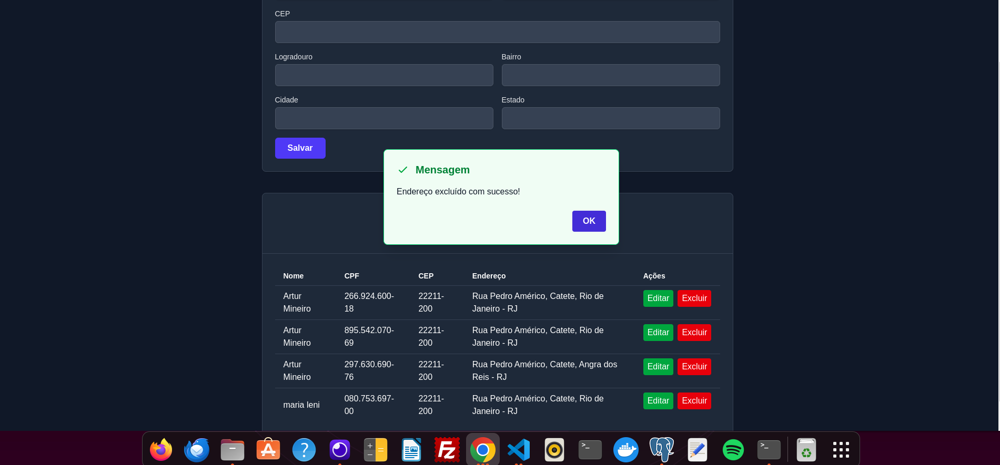
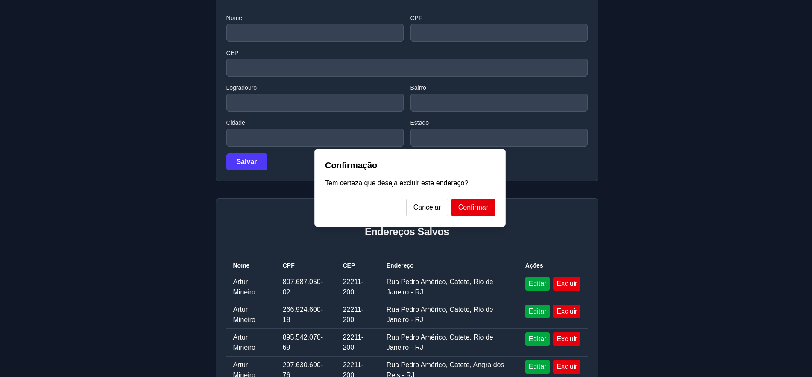

🏠 Gerenciador de Endereços

Este projeto é um sistema para gerenciamento de endereços, com:

Frontend: React + Vite

Backend: Java + Spring Boot

Banco de dados: MySql

Ele utiliza Docker para facilitar a execução local.

🚀 Rodando o Projeto com Docker
✅ Pré-requisitos

Docker: Instalação

Docker Compose (v2 ou superior)

8 GB de RAM (recomendado)

Acesso à internet para baixar imagens

📁 Estrutura do Projeto
desafio_junior/
├── backend/ # Java + Spring Boot
├── frontend/ # React + TypeScript (Vite)
├── docker-compose.yml

🔧 Primeira execução com Docker

📦 Build e execução completa:

docker compose up -d --build

Isso irá:

Baixar as imagens necessárias (openjdk, gradle, node, nginx, postgres)

Buildar o backend via Gradle (./gradlew build)

Buildar o frontend via Vite (npm run build)

Subir os containers: backend, frontend e banco de dados

⏳ O backend pode demorar 1-2 minutos para se conectar ao PostgreSQL nas primeiras vezes, dependendo do seu computador.

🌐 Acessando os serviços

Frontend: http://localhost:5173

Backend (API): http://localhost:8080

📚 Bibliotecas e Tecnologias Utilizadas

Frontend

React com TypeScript

Vite (build e desenvolvimento)

Twind – Estilização utilitária (runtime)

@tanstack/react-query – Fetch e cache de dados assíncronos

axios – Requisições HTTP

react-router-dom – Roteamento de páginas

@shadcn/ui – Componentes de UI modernos e acessíveis

Backend

Spring Boot + Java 21

Gradle – Gerenciador de build

PostgreSQL – Banco de dados relacionalal

TELAS :

# Meu Projeto

## Telas do Sistema

### Tela Inicial

### Lista de Endereços

### Tela de Endereços

### Modal de Edição

### Mensagem de Sucesso

### Responsividade

### Confirmação

